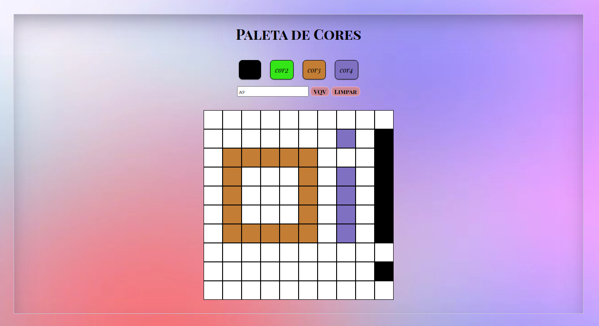
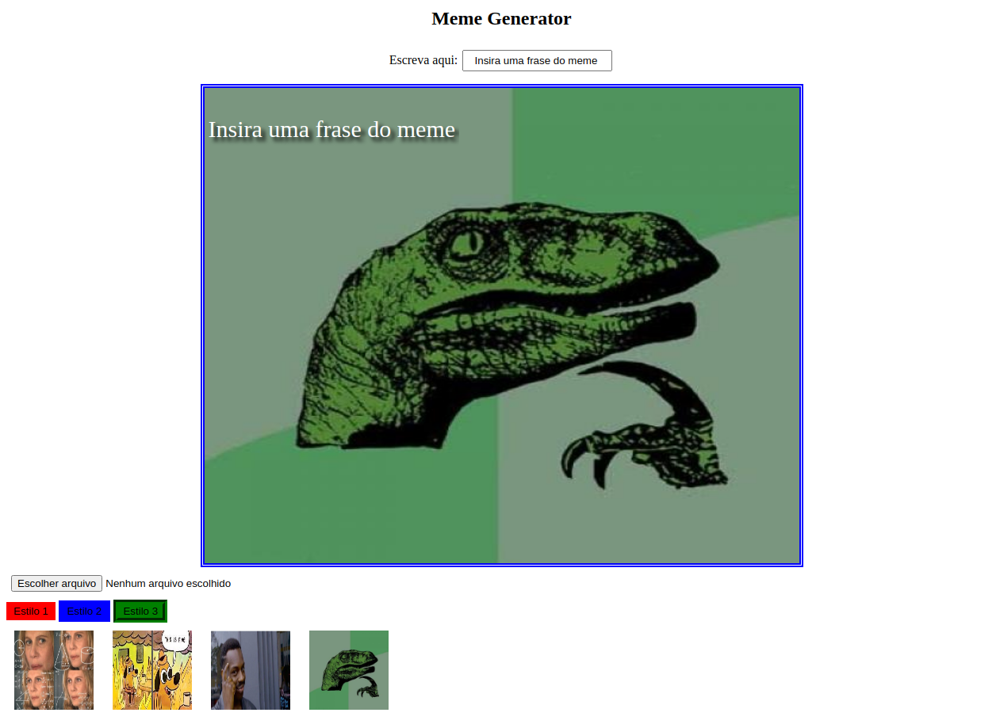
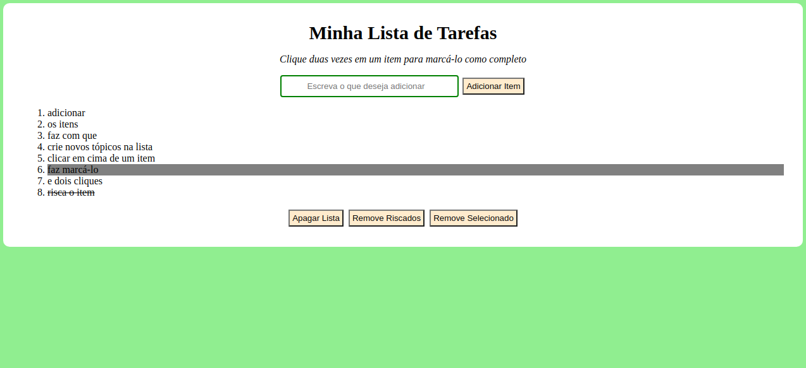

<h2> Sobre esse repositório: </h2>

 Este será o repositório do GitHub onde serão colocados meus projetos, feitos enquanto estudo Desenvolvimento Web na Trybe.  
Cada projeto terá sua propria página web, afim de que sejam melhor vizualizados tanto na parte estética, quanto na parte de seu funcionamento. 
Além disso, cada projeto terá um READ.ME com um breve resumo de qual era o objetivo do projeto.  
&#x2755 Clique na imagem correspondente ao projeto que gostaria de ver!

<!-- <h2> Meu Portifólio </h2>

Primeiros passos ao aprender CSS e HTML nas primeiras semanas de estudo na Trybe
Para acessar a página, só clicar no link: (não funcionando)
[Meu Portifólio](https://clairpenido.github.io/PrimeiroPortifolio) -->

<h2> Projeto Pixels Arte </h2>

<h2> Projeto Gerador de Memes </h2>

<h2> Projeto To-do List </h2>

